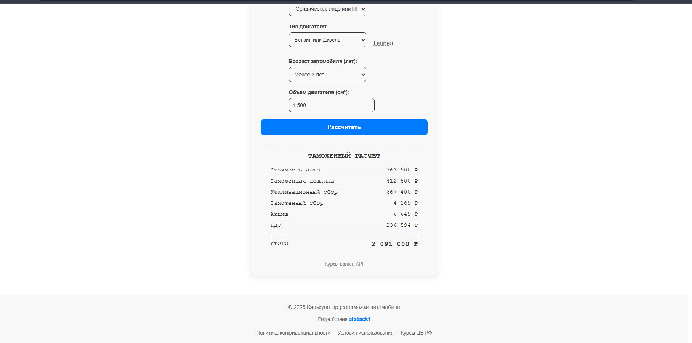
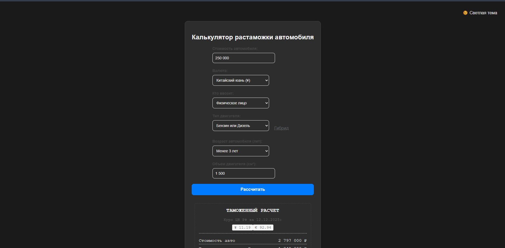
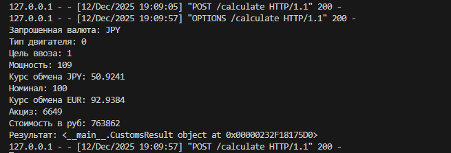

# Customs_calculator_RU
Calculator for calculating customs duties on vehicle imports into the Russian Federation. It is a website that can be integrated into the Telegram mini-app.

## Краткое описание (рус.)

Сервис предназначен для расчета полной стоимости автомобиля при ввозе из других стран. В стоимости учитваются таможенные сборы: таможенная пошлина (в пересчете на EUR и RUB), утильсбор (актуален на 2024 год),
таможенный сбор, акциз (для электромобилей и последовательных гибридов) и НДС. Есть возможность рассчитать ввоз как для физических, так и для юридических лиц.

Курс валют подтягивается из API, в котором курс обновляется ежедневно, что позволяет узнать актуальную стоимость авто. 

Удобный интерфейс калькулятора предлагает выборы параметров в выпадающих списков и предоставляет финальный расчет, состоящий из всех показателей и итоговой стоимости покупки автомобиля. 

На сервере есть логгирование для удобного поиска неполадок и ошибок в расчетах.

### Варианты доработки функционала
- Добавить расчет стоимости доставки автомобиля в город покупателя "под ключ" (доставка, оформление документов);
- Интегрировать как веб-приложение в Телеграм-бот для удобного использования и продвижения внутри мессенджера;
- Актуализировать тарифы (напр. утильсбор).

## Стек
- Frontend: JavaScript, HTML, CSS;
- Backend: C++ (логика расчетов), Python (сервер на Flask управляет кодом на C++, получает данные из API валют, данные с фронтенда, передает для расчета в бэкенд и возвращает результат);

### Что можно улучшить
- Перенести сервер с Flask на Go;
- Переписать логику расчетов тоже на Go;
- Улучшить отображение темной темы.

## Внешний вид
### Фронтенд

### Пример расчета

### Темная тема

### Логгирование

